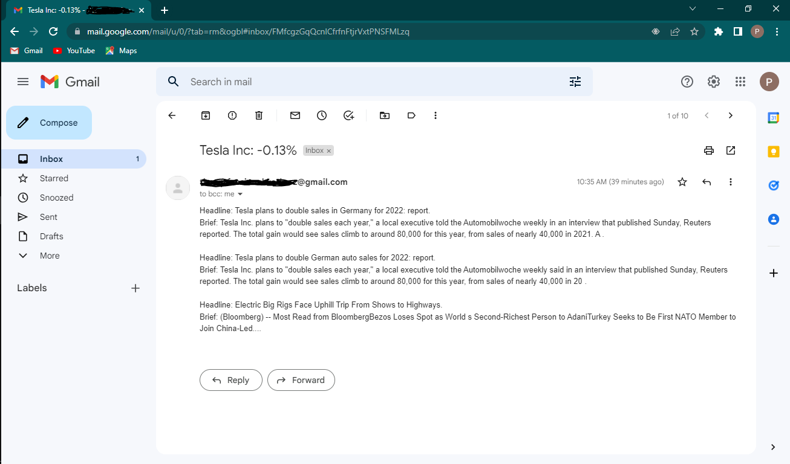

# Stock-News
A script that track the stock of any company in the market
this script track the stock of any company tha you choose and send you a message to your email that tell you if any big changes that happen to that stock, and give a news that related to that stock company.

## How To Use It:
You need to have tokens and acounts from these to API:
1  https://www.alphavantage.co/
2  https://newsapi.org/

- You should first give the script the ``STOCK`` name of that company and the ``COMPANY_NAME``, and ``STOCK_PERCENT_CHANGE``.
- We use the https://www.alphavantage.co api, so you should have and write your ``Stock_API_key`` in the script, and for the news we use https://newsapi.org api so you should write the ``News_API_key`` too.
- Finally, you hove to write your email in ``my_email`` variable, and ``password`` too.
Then you are ready to go.

## The Result Looks:

